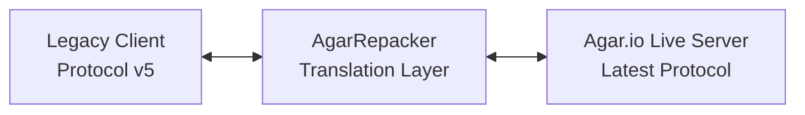

# AgarRepacker

> **Status: Patched / No longer functional.** Agar.io has since changed its protocol and server infrastructure. This tool no longer works against live servers.

## The story behind this

Back around 2016-2017, Agar.io was one of the most popular browser games on the internet. A massive community of players had built third-party clients -- tools like AgarPlus, HKG, and dozens of others -- that connected directly to Agar.io's servers using its original network protocol (protocol version 5). These clients offered features the official page did not (custom skins, extended HUDs, macros, and more).

Then Agar.io updated its protocol.

Overnight, every single one of those clients stopped working. The binary format of the packets changed, the server started compressing world updates with LZ4, and they introduced an XOR encryption layer with rotating keys. The old clients had no idea how to speak this new language.

I was 14 years old at the time, and I wanted to keep using my favorite client. So instead of waiting for someone else to fix it, I created a local WebSocket proxy that sat between the legacy client and the live server, translating packets in real time.

Around the same period, I also implemented a bot-bypass for Google's ReCaptcha system using AI. Agar.io had started gating server access behind ReCaptcha challenges, and I used some maths and logic to bypass it. That work ran in parallel with this repacker -- both were part of the same broader effort to keep the old Agar.io ecosystem alive despite the constant protocol and anti-bot changes the developers were shipping, (I'm not proud of it but it was fun).

## How it worked

The proxy acted as a man-in-the-middle translator between the legacy client and the live server:

On startup, the proxy fetched the latest `agario.js` and `agario.core.js` bundles directly from Agar.io's servers. It used regex to extract the current client version string and protocol version number from the obfuscated code. These values changed with every update, so hardcoding them was not an option.

When a legacy client connected to the local WebSocket server, the proxy opened a parallel connection to the real Agar.io game server. The handshake with the live server used the dynamically extracted version numbers. The server responded with an initialization packet (opcode 241) containing a movement key, from which the proxy derived the full encryption state: a decryption key (XOR of the movement key and the version integer) and an encryption key (MurmurHash2 seeded with the server hostname and version string).

From that point on, every packet from the server was XOR-decrypted, decompressed if needed, deserialized from the modern binary format, and then re-serialized ("repacked") into the protocol-5 format that the legacy client understood. Player inputs flowing the other direction -- movement coordinates, split, eject, spawn commands -- were translated from the old format into the new encrypted format before being forwarded to the server.

The proxy maintained the full game state in memory, cell positions, sizes, colors, skins, nicknames, virus flags, and the leaderboard. It needed this state because the repacking process was not a simple byte-level transformation; the two protocol versions structured their data differently enough that the proxy had to fully parse and reconstruct every packet.

## Acknowledgements

While this specific implementation was developed by me at age 14, it would not have been possible without the collective reverse-engineering efforts of the Agar.io modding community and the **.io research and development group**. A special thanks to everyone who contributed to documenting the evolving binary protocols, encryption schemes, and LZ4 compression implementations during that era of the game.

## License

See [LICENSE](./LICENSE).
